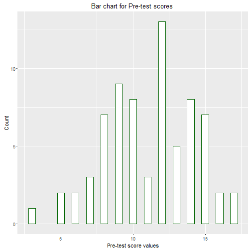

Title: Analysing aids.csv dataset
========================================================
Dataset Reference: http://ces.iisc.ernet.in/hpg/nvjoshi/statspunedatabook/databook.html  

Background
-------------------------
In disease management the proverb ‘prevention is better than cure’ is very relevant. Awareness is the first step in prevention. Hence any materials prepared to enhance awareness constitute a potent weapon in the hands of public health personnel. 

### Dataset description
Columns :   
* A : Sr. no
* B : Pre test score of the student
* C : Post test score of the student
* D : Subject Specialization in code numbers
  * 1: Chemistry (Special)
  * 2: Botany (Special)
  * 3: Microbiology (SYBSc level)
  * 4: Microbiology (Special level)
  * 5: Zoology (Special)
* E: Subject name


Two questions are of interest. Is the post-test score significantly higher than the pretest score? Are differences uniform across subjects and years?

Note that only **ggplot** is used for all the visualisations


```r
library(ggplot2)
```

Read the aids.csv dataset to the R environment 

```r
aids <- read.csv("./data/aids.csv")
```
Verify the file loaded into the dataset

```r
str(aids) 
```

```
## 'data.frame':	72 obs. of  5 variables:
##  $ SR_NO       : int  1 2 3 4 5 6 7 8 9 10 ...
##  $ PRE_TEST    : int  12 13 8 9 10 7 10 12 12 3 ...
##  $ POST_TEST   : int  19 19 19 19 18 19 18 19 19 14 ...
##  $ Subject_Code: int  1 1 1 1 1 1 1 1 1 1 ...
##  $ Subject_Name: Factor w/ 5 levels "Botany","Chemistry",..: 2 2 2 2 2 2 2 2 2 2 ...
```

* The PRE_TEST variable contains the score of respondent on AIDS before going through the awareness materials.

* The POST_TEST variable contains the score of respondent on AIDS after going through the awareness materials.

To assess the effectiveness of the awareness material, we have to check whether the post-test scores are significantly higher than the pretest scores.

Before performing any statistical test, let us check the descriptive statistics and plots.
#### Descriptive statistics and visualisation of data
Summary of pre-test scores

```r
summary(aids$PRE_TEST)
```

```
##    Min. 1st Qu.  Median    Mean 3rd Qu.    Max. 
##    3.00    9.00   12.00   11.11   14.00   17.00
```

Summary of post-test scores

```r
summary(aids$POST_TEST)
```

```
##    Min. 1st Qu.  Median    Mean 3rd Qu.    Max. 
##      12      17      18      18      19      20
```
Standard deviation of pre-test scores

```r
sd(aids$PRE_TEST)
```

```
## [1] 3.092725
```
Standard deviation of post-test scores

```r
sd(aids$POST_TEST)
```

```
## [1] 1.618554
```
Bar chart for pre-test scores

```r
ggplot(aids,aes(PRE_TEST))+geom_bar(width=0.5,fill="white", colour="darkgreen")+ xlab("Pre-test score values")+ylab("Count")+ggtitle("Bar chart for Pre-test scores ")
```

 

Bar chart for post-test scores

```r
ggplot(aids,aes(POST_TEST))+geom_bar(width=0.5,fill="white", colour="darkgreen")+ xlab("Post-test score values")+ylab("Count")+ggtitle("Bar chart for Post-test scores ")
```

 

Density plot for pre-test scores

```r
ggplot(aids,aes(PRE_TEST))+geom_density(fill="white", colour="darkgreen")+ xlab("Pre-test score values")+ggtitle("Density plot for Pre-test scores ")
```

 

Density plot for post-test scores

```r
ggplot(aids,aes(POST_TEST))+geom_density(fill="white", colour="darkgreen")+ xlab("Post-test score values")+ggtitle("Density plot for Post-test scores ")
```

 

From the bar charts and density plots, it is apparent that there is an increase in number of participants scored higher in post-test than in pre-test scores after going through the awareness materials.

boxplot for pre-test scores

```r
boxplot(aids$PRE_TEST)
```

 

boxplot for post-test scores

```r
boxplot(aids$POST_TEST)
```

 

The above box-plots too indicate that there is shift in number of participants scoring higher in post-test than in pre-test.

### Further investigations
Prima facie it appears that the post-test scores are higher than the pre-test scores. One should not draw conclusions based on descriptive statistics.

* A paired t-test will be performed here as the data is collected from the same subjects before and after the intervention i.e., AIDS awareness materials

* A prerequisite for performing t-test is that the difference between the paired values should meet the assumption of normality and homogenity of the variances.

#### Normality test
* normtest() function picked from the example [here](http://mgmt.iisc.ernet.in/CM/MG221/Handouts/1_2_Sample.pdf)

```r
normtest <- function(x)
  {
  library(nortest)
  s <- shapiro.test(x)
  ad <- ad.test(x)
  cvm <- cvm.test(x)
  sf <- sf.test(x)
  df <- data.frame(Method = c(s$method,ad$method,cvm$method,sf$method),
    P.Value = c(s$p.value,ad$p.value,cvm$p.value,sf$p.value))
  df
  }
```

QQPlot for the difference between pre-test & post-test scores

```r
qqnorm(aids$POST_TEST-aids$PRE_TEST)
```

 

Testing normality for difference between pre-test & post-test scores

```r
normtest(aids$POST_TEST-aids$PRE_TEST)
```

```
##                            Method    P.Value
## 1     Shapiro-Wilk normality test 0.10623495
## 2 Anderson-Darling normality test 0.04337221
## 3 Cramer-von Mises normality test 0.04539567
## 4  Shapiro-Francia normality test 0.14810660
```

It is interesting to note that the Shapiro-Wilk and Shapiro-Francia tests (p-value > 0.05) lack evidence to reject the normality where as the Anderson-Darling and Cramer-von Mises tests (p-value < 0.05) do not. Without jumping into any conclusions, let us investigate whether there are any outliers in the data.


```r
boxplot(aids$POST_TEST-aids$PRE_TEST,xlab="Boxplot for difference between pre-test & post-test scores", ylab="Count")
```

 

From the boxplot, it is visible that there are no outliers. The qq-plot, and the normality tests throws us mixed results to take a decision whether to accept this data as normal. This is a rare scenario, and I would give benefit of doubt and proceed with the assumption of normality.  
* [Read this blogpost on the assumption of normality & testing](http://www.r-bloggers.com/normality-and-testing-for-normality/)

#### Test for equal variances
The second assumption to be tested is homogenity of variances

```r
var.test(aids$PRE_TEST,aids$POST_TEST)
```

```
## 
## 	F test to compare two variances
## 
## data:  aids$PRE_TEST and aids$POST_TEST
## F = 3.6511, num df = 71, denom df = 71, p-value = 1.412e-07
## alternative hypothesis: true ratio of variances is not equal to 1
## 95 percent confidence interval:
##  2.284329 5.835756
## sample estimates:
## ratio of variances 
##           3.651135
```
* The results (p-value < 0.05) support our the assumption of homegenity in the two variances.

### Hypotheses testing
The null hypothesis is that there is no difference between the mean scores of pre-test and post-test scores.


```r
t.test(aids$PRE_TEST,aids$POST_TEST,var.equal=TRUE,alternative="two.sided",paired=TRUE)
```

```
## 
## 	Paired t-test
## 
## data:  aids$PRE_TEST and aids$POST_TEST
## t = -23.294, df = 71, p-value < 2.2e-16
## alternative hypothesis: true difference in means is not equal to 0
## 95 percent confidence interval:
##  -7.478581 -6.299197
## sample estimates:
## mean of the differences 
##               -6.888889
```

From the results(p-value < 0.05), it can be stated that there is no evidence to support the null hypothesis, and there exists difference between the mean scores of pre-test and post-test.

Now, let us test whether the post-test scores are significantly higher than the pre-test scores. This makes it a one tailed test

**The null hypothesis is - no difference between the mean scores of pre-test and post-test.**

**Alternate hypothesis is - there is difference mean scores of pre-test and post-test, and the mean of post-test scores is higher than pre-test scores.**

```r
t.test(aids$POST_TEST,aids$PRE_TEST,var.equal=TRUE,alternative="greater",paired=TRUE)
```

```
## 
## 	Paired t-test
## 
## data:  aids$POST_TEST and aids$PRE_TEST
## t = 23.294, df = 71, p-value < 2.2e-16
## alternative hypothesis: true difference in means is greater than 0
## 95 percent confidence interval:
##  6.396006      Inf
## sample estimates:
## mean of the differences 
##                6.888889
```
The results (p-value < 0.05) show that the mean of post-test scores is significantly higher than the pre-test scores. The AIDS awareness booklet has intended benefits i.e., to increase the awareness on AIDS.

Note:- It is not required to perform the first paried t-test. It's been illustrated to help understand and appreciate the concept better.
