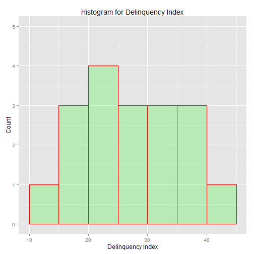
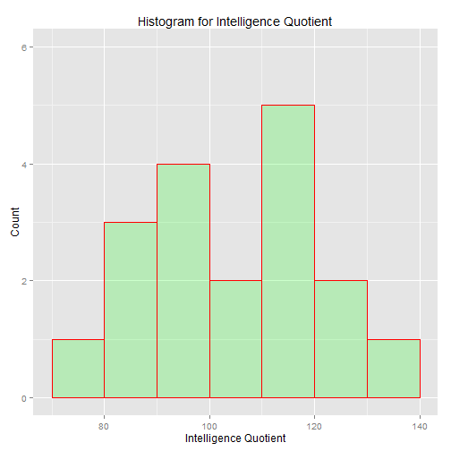

Title: Analysing crime.csv dataset
========================================================
Dataset Reference: http://ces.iisc.ernet.in/hpg/nvjoshi/statspunedatabook/databook.html  
Background: It is of interest to know the relationship between intelligence of the criminal and his delinquency (crime) index (from 0 to 50), which is a combination of frequency of crime and seriousness of criminal acts of an individual. This may help in ‘managing’ the case in jail. So we need to know the general rule and exceptions if any etc.  
 
Delinquency is the tendency of young persons to commit minor crime. 
Intelligence quotient is an individual's reasoning ability.

A good explanatin on IQ and delinquency is provided in [this link](http://www.encyclopedia.com/doc/1G2-3403000143.html)

Note that only **ggplot** is used for all the visualisations


```r
library(ggplot2)
#Read the Crime.csv dataset to the R environment 
Crime <- read.csv("./data/Crime.csv")

#Explore the nature of the data
str(Crime)
```

```
## 'data.frame':	18 obs. of  2 variables:
##  $ Delinquency.index    : num  26.2 33 17.5 25.2 20.3 ...
##  $ Intelligence.Quotient: int  110 89 102 98 110 98 122 119 120 92 ...
```

```r
summary(Crime)
```

```
##  Delinquency.index Intelligence.Quotient
##  Min.   :10.70     Min.   : 73.0        
##  1st Qu.:20.50     1st Qu.: 90.5        
##  Median :25.20     Median :103.0        
##  Mean   :26.58     Mean   :103.2        
##  3rd Qu.:32.73     3rd Qu.:115.5        
##  Max.   :41.10     Max.   :134.0
```

```r
#Histogram for the variable delinquency index hist(Crime$Delinquency.index)
ggplot(Crime, aes(x=Delinquency.index))+geom_histogram(breaks=seq(10, 45, by = 5),col="red", fill="green", alpha = .2) + labs(title="Histogram for Delinquency Index") + labs(x="Delinquency Index", y="Count") +  xlim(c(10,45)) + ylim(c(0,5))
```

 

```r
#Histogram for the variable intelligence quotient hist(Crime$Intelligence.Quotient)
ggplot(Crime, aes(x=Intelligence.Quotient))+geom_histogram(breaks=seq(70, 140, by = 10),col="red", fill="green", alpha = .2) + labs(title="Histogram for Intelligence Quotient") + labs(x="Intelligence Quotient", y="Count") +  xlim(c(70,140)) + ylim(c(0,6))
```

 

```r
#Scatterplot between the variables delinquency index and intelligence quotient
ggplot(Crime, aes(y=Delinquency.index, x=Intelligence.Quotient)) + geom_point(shape=1) +    # Use hollow circles 
  geom_smooth() + xlabs(x="Intelligence Quotient") +ylabs("Delinquency Index")+title("Scatter plot - Delinquency Index and Intelligence Quotient ")
```

```
## Error in eval(expr, envir, enclos): could not find function "xlabs"
```

```r
#From the plot, it can be assumed that delinquency index and intelligence quotient are negatively correlated. Let us look at the correlation coefficient between them

cor(Crime, use="complete.obs",method="pearson")
```

```
##                       Delinquency.index Intelligence.Quotient
## Delinquency.index              1.000000             -0.474686
## Intelligence.Quotient         -0.474686              1.000000
```

```r
#The value of pearson correlation coefficient is -0.47 indicates that as depicted in the above scatter plot the delinquency index and intelligence quotient are negatively correlated with a moderate strength of relationship.
```
The following table is generally referred to interpret correlation coefficient and the strength of relationship between the variables under study.

Correlation Coefficient value range  | Strength of relationship
------------- | -------------
-1 to -0.5  | Strong and negative
-0.5 to -0.3  | Moderate and negative
-.03 to -0.1  | Weak and negative
-.01 to +0.1  | Very weak or no relationship
+.01 to +0.3  | Weak and positive
+0.3 to -.5  | Moderate and positive
+0.5 to +1  | Strong and positive
